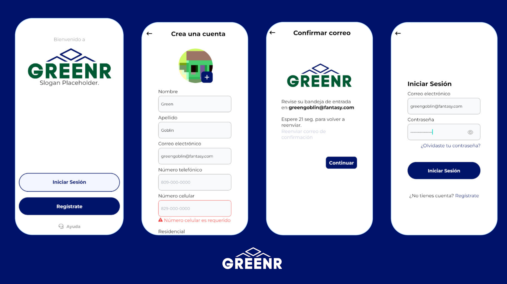
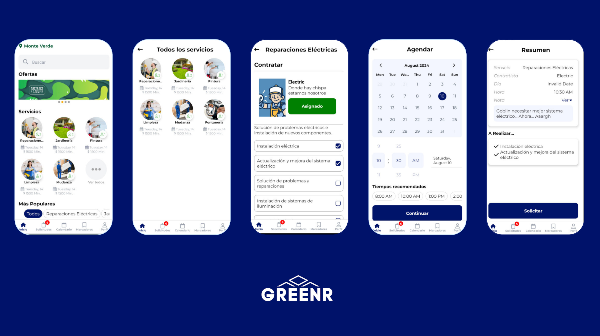
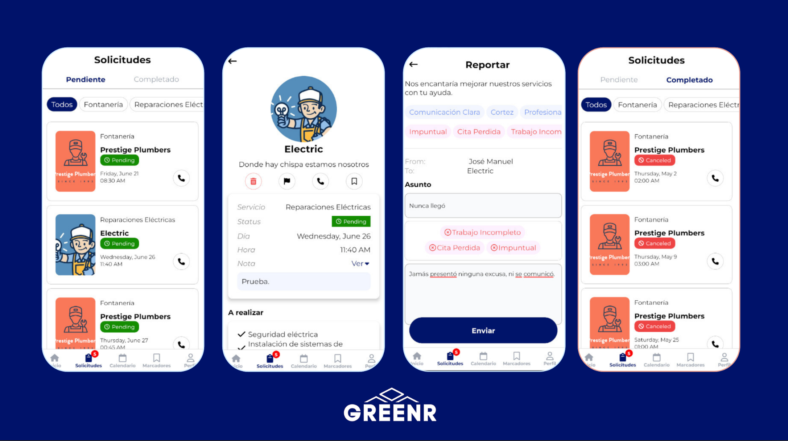
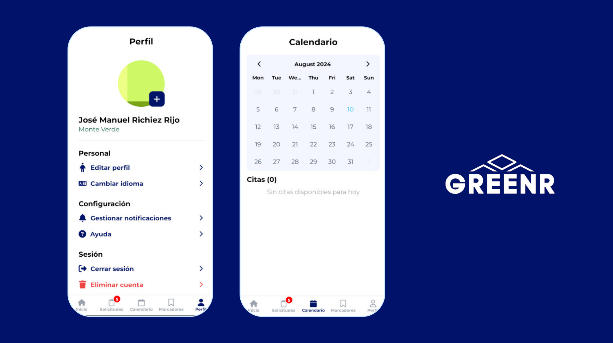

# Green Residential

Green Residential is a __cross-platform mobile application__ using __React Native__ and TypeScript
with __Expo__, enabling users to book home services like plumbing and painting. Features include service scheduling, appointment tracking, and reporting tools. I engineered the back-end using __Supabase__ (PostgreSQL), implemented secure authentication via JWT and Edge Functions.

# Showcase

### Authentication Flow



### Order Service Flow



### Request Management



### Settings & Scheduling




# 🚀 Technical Highlights

- **Server State Management:** Implemented **TanStack Query (v5)** for robust caching, optimistic updates, and seamless data synchronization with the backend.
    
- **Type-Safe Forms:** Leveraged **Zod** schema validation with **React Hook Form** to ensure zero-error user inputs.
    
- **Scalable Backend:** Engineered using **Supabase (PostgreSQL)**, utilizing **Edge Functions** for server-side logic and **JWT** for secure, role-based authentication.
    
- **Modern Navigation:** Built with **Expo Router**, providing a native-feeling file-based routing system.

# Getting Started

>**Note**: Make sure you have completed the [React Native - Environment Setup](https://reactnative.dev/docs/environment-setup) instructions till "Creating a new application" step, before proceeding.

## Step 1: Start the Metro Server

First, you will need to start **Metro**, the JavaScript _bundler_ that ships _with_ React Native.

To start Metro, run the following command from the _root_ of your React Native project:

```bash
# using npm
npm start

# OR using Yarn
yarn start
```

## Step 2: Start your Application

Let Metro Bundler run in its _own_ terminal. Open a _new_ terminal from the _root_ of your React Native project. Run the following command to start your _Android_ or _iOS_ app:

### For Android

```bash
npm run android
```

### For iOS

```bash
npm run ios
```

If everything is set up _correctly_, you should see your new app running in your _Android Emulator_ or _iOS Simulator_ shortly provided you have set up your emulator/simulator correctly.

This is one way to run your app — you can also run it directly from within Android Studio and Xcode respectively.

## Step 3: Modifying your App

Now that you have successfully run the app, let's modify it.

1. Open `App.tsx` in your text editor of choice and edit some lines.
2. For **Android**: Press the <kbd>R</kbd> key twice or select **"Reload"** from the **Developer Menu** (<kbd>Ctrl</kbd> + <kbd>M</kbd> (on Window and Linux) or <kbd>Cmd ⌘</kbd> + <kbd>M</kbd> (on macOS)) to see your changes!

   For **iOS**: Hit <kbd>Cmd ⌘</kbd> + <kbd>R</kbd> in your iOS Simulator to reload the app and see your changes!

# Troubleshooting

If you can't get this to work, see the [Troubleshooting](https://reactnative.dev/docs/troubleshooting) page.
